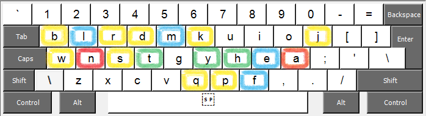
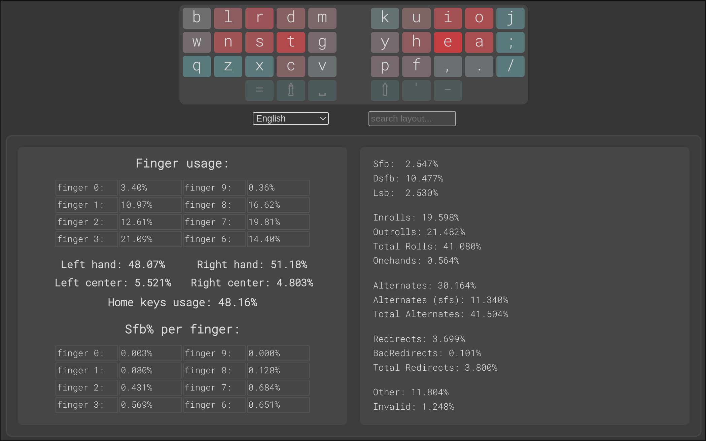
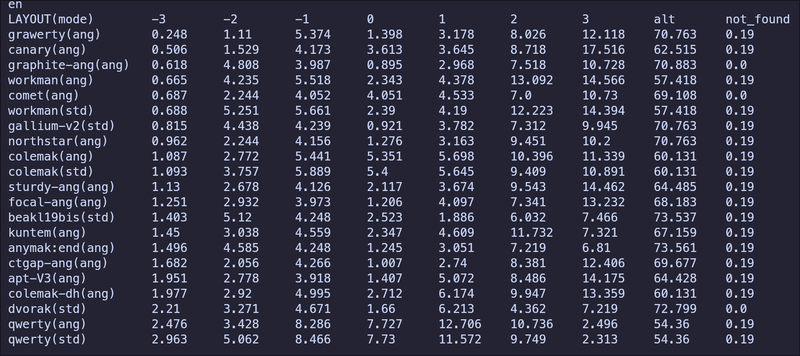

# Grawerty

Grawerty - это раскладка для комфортного набора на английском языке. Изначально сделана для стандартной клавиатуры, но может быть адаптирована для других типов клавиатур. При наборе используется Angle Mod - `c` - указательный, `x` - средний, `z` - безымянный.

## Почему появилась Grawerty

Первая альтернативная раскладка, на которую я перешел был Graphite и она действительно оказалась намного приятнее чем Qwerty - обучение шло быстрее и комфортнее. За месяц я достиг скорости 250 знаков в минуту и скорость не переставая росла. Но я заметил некоторые нудобства, которые для меня оказались критичными:

- я не люблю перекаты, в которых участвует мизинец и средний палец, а их в графите много - `nd`, `nt`, `io`, `ai`, `ia`
- после Qwerty расположение `t` не на указательном пальце было очень непривычно, но даже без привязки к Qwerty я считаю (для себя), что расположение `t` на указательном пальце очень удобно и естественно. Кстати, создатель графита в своих следующих раскладках располагает `t` на указательном пальце.
- мне не нравится расположение `m` в графите, т.к. для меня набор `rm`, `rms`, `mb`, `lm` становится неудобным
- `br`, `ui` - набирать не комфортно, поэтому при создании раскладки следил за полу-ножницами, особенно на мизинце и безымянном
- я не люблю слабые перенаправления и стараюсь их избегать - в графите их значительно меньше, чем в стандартой раскладке, но их можно снизить ещё больше

## Требования к раскладке

- устранить недостатки графита, не наплодив новых недостатков
- количество перенаправлений - старался, чтобы не очень увеличилось по сравнению с графитом
- значительно снизить количество слабых перенаправлений
- нравится, что в графите поменяли руку только 6 букв - так их и оставить - ничего не менять
- SFB - старался, чтобы их значение не превысило SFB в Dvorak
- появившиеся дополнительные SFB должно быть удобно набирать, SFB на мизинце недопустимы, в том числе и SFB(0u) - повторы одной буквы
- Практически нулевое количество ножниц (кроме тех, когда указательный палец внизу, а средний или безымянный вверху)
- Практически нулевое значение полуножниц на мизинце/безымянном
- расположение `c`, `v` - совпадает с Qwerty и Graphite(Angle Mod)
- по возможости сохранить расположение букв стандартной раскладки. Если изменение делается, то оно должно нести существенный выигрыш

## Результат

Все требования удалось реализовать, но я не смог сделать раскладку, которая удовлетворяла бы этим требованиям и при этом нагружала мизинцы (нагрузка на мизинцы меня не смущает, если буквы на мизинцах не образуют неудобных сочетаний). Поэтому получилась раскладка, которая имеет низко нагруженные мизинцы. Как можно заметить, она имеет много общего как с Qwerty, так и с Graphite, поэтому называется Grawerty.

Расположение букв `u`, `i`, `o` получилось как в стандартной раскладке не для сохранения похожести, а потому, что такое расположение букв наилучшим образом удовлетворяет тебованиям к новой раскладке. Сюрприз. Тоже самое касается буквы `c` - она сохранила свое место в том числе и потому, что перемещение её на другие пальцы хоть и снижает sfb, но при этом происходит увеличение других неудобных сочетаний - слабых редиректов, полуножниц, перекатов мизинец/средний (которые я не люблю).

## Сравнение с графитом и другими раскладками

### Триграммы

1. Общее количество перенаправлений увеличилось всего на 0.8% по сравнению с графитом - это меня устраивает
2. Количество слабых перенаправлений снизилось на 0.3% и стало очень не значительным - 0.1%
3. Количество перекатов немного снизилось, но я на их количество, вообще не обращаю внимания, т.к. в эти перекаты попадают ножницы и прочие неудобные сочетания. Смотрю только, чтобы перекатов наружу было не намного больше, чем внутрь.

### Биграммы

SFB - с моей точки зрения этот параметр излишне демонизируют и стараются оптимизировать любой ценой, но при этом появляются другие неудобные сочетания, которые современные анализаторы не отлавливают, т.к. их анализ биграмм не полный. В этом можно убедиться, если сложить значения всех проанализированных биграмм: sfb + lsb + scissors < 5%. А где остальные?

Итак, SFB = 2.55%. В два с половиной раза больше, чем у графита! Тут все разворачиваются и идут по своим делам - т.к. сразу считают, что это плохая раскладка. Но на самом деле SFB ещё больше, т.к. анализатор не учел повторы одной буквы, которые для английского языка добавляют 2.3%.

Теперь, Grawerty - 4.85%, а графит - 3.3%. Уже не такая большая разница - не так ли? На 50% больше, чем у графита. Эти дополнительные проценты довольно удобно нажимать, т.к. они сконцентрированы всего в нескольких биграммах на указательных и средних пальцах. `rs`, `ie` - удобные, `ct`, `e,` - менее удобно, но не критично, `up`, `pu`, `fu`, `dg`, `dv` - легко нажимаются с использованием указательного и среднего пальца - это довольно привычно пользователям Qwerty.

Ножницы - практически такие же как в графите

LSB - 2.5%. Графит - 1.4%. Для меня приемлемо.

Дальше, анализ биграмм для анализаторов заканчивается, хотя проанализировано довольно мало. Чтобы восполнить этот пробел, я сделал собственный анализатор биграмм - [ABA](https://github.com/mohoaz1348-rgb/layout_bigrams_analyzer) - All Bigrams Analyzer. У него совершенно отличная концепция от других анализаторов, поэтому чтобы понять, что и как он анализирует прочитайте ридми файл.

Вот, результаты в процентах для некоторых раскладок:

`-3` - самые неудобные сочетания, `3` - самые удобные

Видно, что согласно матрице моих собственных предпочтений - Grwerty самая удобная раскладка (для меня). Вы самостоятельно можете поменять эту матрицу под себя и посмотреть какая раскладка будет наиболее удобна для вас. Но процесс это трудоёмкий и требует наблюдания за собой и непредвзятости.

